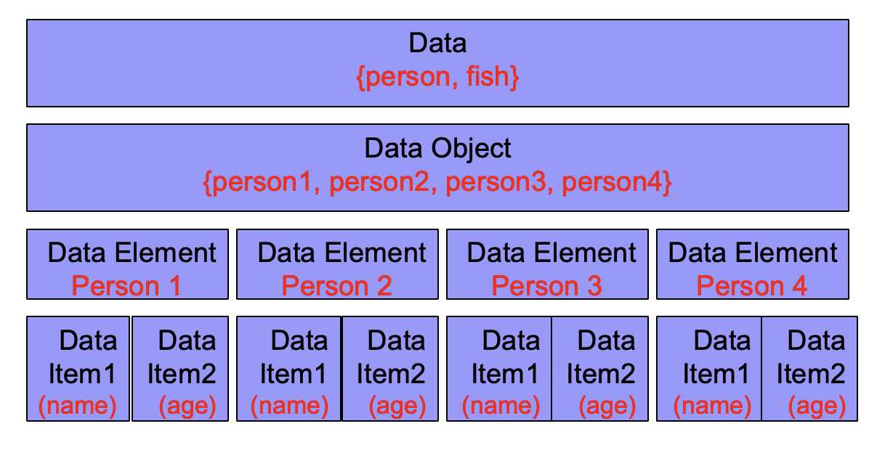
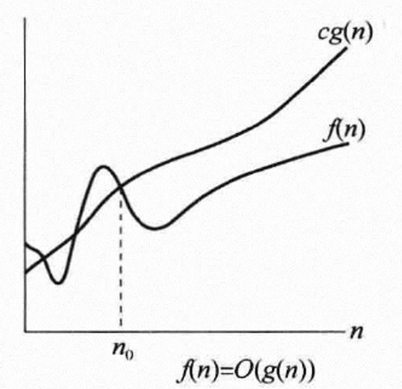
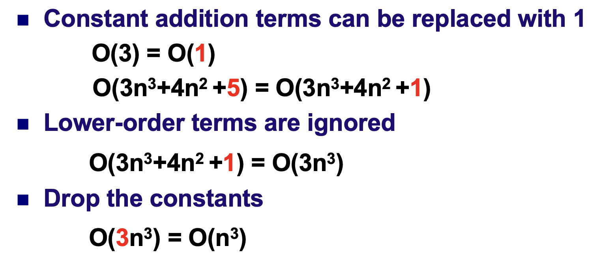
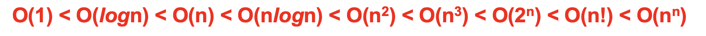
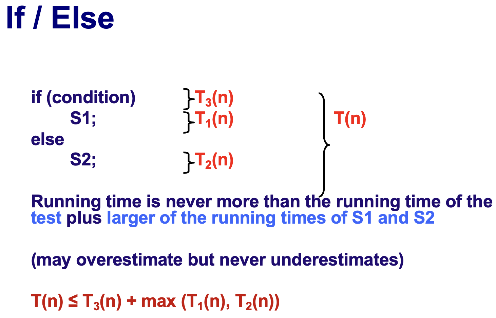

# 基本概念  

## 结构  

### 数据结构  



#### 逻辑结构  
- **Set**：集合，元素之间无特定关系。  
- **Linear**：线性结构，元素之间存在一对一关系。  
- **Tree**：树状结构，元素之间存在一对多关系。  
- **Graphic**：图状结构，元素之间存在多对多关系。  
  
#### 物理结构  
- **Sequential Storage Structure**（顺序存储结构）：元素在内存中连续存储，如数组。  
- **Linked Storage Structure**（链式存储结构）：元素通过指针或引用连接，如链表。  
  
### 数据类型  
- **实际数据类型**：如整型、浮点型等。  
- **抽象数据类型 (ADTs, Abstract Data Types)**：用户自定义的数据类型，通过操作集合来定义。  
  - **优点**：模块化设计。  
  
## 算法  

### 时间复杂度 T(N)  

#### 三个假设 
$$
T_{avg}(N) \And T_{worst}(N)
$$

1. 指令按顺序执行。  
2. 每一步被视作一个时间复杂度。  
3. 整型数据内存大小一定，且拥有无限内存空间。  

#### Asymptotic Notations（渐进表示法） 
$$
T(N)= O(f(N))
$$



#### 常见时间复杂度  
##### Constant order 常数阶

```c
int sum = 0, n = 100;    // 1 step
sum =  (1 + n ) * n/2;    // 1 step (or 4 step ✓) 
printf (“%d”, sum) ;     // 1 step  
```
$$
T_N   = O(3) = O(1) 
$$

##### Linear order 线性阶

```c
int i; for (i = 0; i < n; i++) 
{ 
    /*execution steps of O(1) */ 
} 
```

$$
T_N   = O(N)  
$$

##### Log order 对数阶

```c
int count = 1;
 while (count < n) {
    count = count * 2;      
    /*execution steps of O(1) */ 
} 
```

$$
2^X=n \ge x=log_2n
$$

$$
T_N = O(logn)
$$

##### Square order 平方阶

- 1
  
  ```c
  int i j;
  for (i = 0; i < n; i++){      
      for (j = 0; j < n; j++){           
          /*execution steps of O(1) */       
      } 
  } 
  ```
  
$$
T_N   = O(N^2)
$$

- 2
  
  ```c
  int i j;
  for (i = 0; i < m; i++) {
        for (j = 0; j < n; j++){
            /*execution steps of O(1) */       
      } 
  }
  ```
  
$$
T_N   = O(m \times n)
$$

- 3
  
  ```c
  int i j;
  for (i = 0; i < n; i++){
      for (j = i; j < n; j++){
          /*execution steps of O(1) */   
      }
  } 
  ```

$$
T(N) = n + (n-1) + (n-2) +…+1= (n^2+n)/2 = O(n^2)
$$

##### 如何得到O(n)  
- **O(n)的计算**：通常关注算法中最高次项，忽略低次项和常数项。 




- 在选择语句中


$$
T_{1}(N)+T_{2}(N)= max(O(f(N)),O(g(N)))
$$

$$
T_{1}(N)*T_{2}(N)=O(f(N)*g(N))
$$


##### 其他三种（了解即可）  
- Ω(n), θ(n), o(n)  
  
### 常见算法策略  
#### 递归：函数直接或间接调用自身。  
```c
int factorial (int n)
{
    if (n<=1)
        return 1; // one for the base case
    else // one for else
        return n*factorial(n-1); // 1 for multiplication+ 1 for substraction+ cost of evaluation of factorial(n-1)  
}
```
- **斐波那契问题**：Fib(0) = Fib(1) = 1,  Fib(n) = Fib(n-1) + Fib(n-2)
```c
Fib (int N)
{
    if (N<=1)
        return 1;
    else
        return Fib(N-1)+Fib(N-2);
}

```

$$
T(N) = T(N-1)+T(N-2)+2 \ge Fib(N)
(3/2)^N \le Fib(N) \le (5/3)^N 可见时间复杂度呈指数型增长
$$

#### 问题引入：最大子序列求和问题 Maximun Subsequence Sum Problem**
- Given (possibly negative) integers A1, A2, …, AN, find the maximum value of 
  $$
  {\textstyle \sum_{j}^{k=i}}A_k
  $$

  算法1
```c
int  MaxSubsequenceSum ( const int A[],  int  N ) { 
    int  ThisSum,  MaxSum,  i,  j,  k; 
    MaxSum = 0;   /* initialize the maximum sum */
       for( i = 0; i < N; i++ ){ /* start from A[ i ] */
           for( j = i; j < N; j++ ) {   /* end at A[ j ] */
               ThisSum = 0; 
               for( k = i; k <= j; k++){
                   ThisSum += A[k];  /* sum from A[ i ] to A[ j ] */
                   if ( ThisSum > MaxSum)  MaxSum = ThisSum;  /* update max sum */
               }
           }  /* end for-j and for-i */
       }
     return  MaxSum; 
} 
```
$$
T(N) = O(N^3)
$$

算法2
```c
int  MaxSubsequenceSum ( const int A[],  int  N ) { 
    int  ThisSum,  MaxSum,  i,  j; 
    MaxSum = 0;   /* initialize the maximum sum */
    for( i = 0; i < N; i++ )  {   /* start from A[ i ] */
           ThisSum = 0; 
           for( j = i; j < N; j++ ) {   /* end at A[ j ] */
                ThisSum += A[ j ];  /* sum from A[ i ] to A[ j ] */
                 if ( ThisSum > MaxSum ) MaxSum = ThisSum;  /* update max sum */
          }  /* end for-j */
      }  /* end for-i */
      return  MaxSum; 
} 
```
$$
T(N) = O(N^3)
$$

**算法3——分治法（Divide and Conquer）**
将一个数组及其子数组不断从中间分为两部分，通过递归比较L&R&LR的子序列和的大小

```c
// arr[l]...arr[r]

int findMax(int l, int r){
    // 初始化左边子数组的和与最大和
    int sumL = 0, maxL = sum[m];
    // 初始化右边子数组的和与最大和
    int sumR = 0, maxR = sum[m+1];
    
    // 从m向l遍历，寻找左边子数组的最大和
    for (int i = m; i >= l; i--){
        sumL += arr[i];
        maxL = max(maxL, sumL);
    }
    
    // 从m+1向r遍历，寻找右边子数组的最大和
    for (int i = m + 1; i <= r; i++){
        sumR += arr[i];
        maxR = max(maxR, sumR);
    }
    return maxL + maxR;
}

int MaxSubsequenceSum ( int l, int r ){
    // 如果范围只包含一个元素，直接返回该元素的值
    if (l == r) return arr[l];
    else{
        // 使用分治法，找到中间点
        int mid = (l + r) / 2;
        
        // 递归计算左边的最大子数组和
        int L = MaxSubsequenceSum(l, mid); // T(N/2)
        
        // 递归计算右边的最大子数组和
        int R = MaxSubsequenceSum(mid + 1, r); // T(N/2)
        
        // 计算跨越中间点的最大子数组和
        int LR = findMax(l, r); // O(N)
        
        // 返回三者中的最大值
        return max(LR, max(L, R));
    }
}
```

$$
T(N)=2T(N/2)+O(N) = O(NlogN) （过程略）
$$

**算法4——On-line Algorithm**：在线算法，处理输入数据时，必须立即产生输出，无法看到全部输入数据。
- 适合动态输入：如果数据是动态到达的（即流式数据），Kadane’s Algorithm 能够在每一步实时更新结果，因此它是一个在线算法的经典例子。
- 在线算法的使用场景：
    - 流式数据处理：Kadane's Algorithm 适合处理动态输入数据，能够在数据不断变化或增加时持续计算最大子序列和。
    - 实时计算问题：当你不能提前知道所有输入数据时，在线算法能随着数据的到来不断更新最优解。

```c
int MaxSubsequenceSum( const int  A[ ],  int  N ) 
{ 
    int  ThisSum, MaxSum, j; 
/* 1*/ 	ThisSum = MaxSum = 0; 
/* 2*/ 	for ( j = 0; j < N; j++ ) { 
/* 3*/ 	      ThisSum += A[ j ]; 
/* 4*/ 	      if  ( ThisSum > MaxSum ) 
/* 5*/ 		MaxSum = ThisSum; 
/* 6*/ 	      else if ( ThisSum < 0 ) // 当和为负的时候，则必定对后面的数产生负作用，使后一个数变小，所以直接置零将后一个数作为新的子序列的开头
/* 7*/ 		ThisSum = 0;
    }  /* end for-j */
/* 8*/ 	return MaxSum; 
} 

```
$$
T(N) = O(N)
$$

# Linear List 线性表

## 概念  

线性表是元素间存在一对一关系，每个元素（除了最后一个）都有唯一后继者的列表。  


## 类别  

### 一般类  
可以在列表中的任意位置插入和删除数据。  
- **数组**  
- **链表**  
- **游标**（通常指遍历线性表的指针或迭代器）  
- **双链表**  
- **环形链表**  
  
### 限制类  
只可以在列表的末尾插入或删除数据。  
- **堆栈 (Stack)**：Last-In-First-Out（后进先出）。  
- **队列 (Queue)**：First-In-First-Out（先进先出）。


## Array List 数组

- Elements are stored contiguously in memory as an array (easy to find kth element) 元素作为数组连续存储在内存中（容易找到第k个元素）

- Simple array implementation 简单的阵列实现
  
  - Must know estimate of size before hand (waste of space) 必须事先知道尺寸估计（浪费空间）
  
  - Insert and Delete: expensive  插入和删除：昂贵

| 0            |               |
| ------------:|:-------------:|
| 1            | element[1]    |
| 2            | element[2]    |
| 3            | Element[3]    |
|              | ……            |
| 1 ≤ i ≤ last | element[i]    |
|              | ……            |
|              | ……            |
| last         | element[last] |
|              | ……            |
| maxlength-1  |               |

```c
//Type Definition： 类型定义
# define maxlength 100 
struct LIST {      
    elementtype * elements;
    int last; 
}; 
//Position Type：重定义
    typedef int position; 
//Linear List L: 声明结构
    struct LIST L; 
//Initialization: 初始化
    L.elements= (elemttype *)  malloc  (maxlength* sizeof (elemttype))  
//Representation：调用
    L.elements[p] // pth element       
    L.last // length of L, position of last element 
```

### 插入（前插） Array list-INSERT Operation

```c
 void Insert (int newItem, List &L, int location) {       
     int i;       
     if (L.last + 1 == maxlength) {//array is full 数组已满          
         int *b = new int[2 * maxlength]; // Allocate a new array, twice as long. 分配一个新数组，长度是原来的两倍。
         for (i = 0; i <= L.last; i++) {// Copy items to the bigger array.将项目复制到更大的数组。
             b[i] = L.elements[i];           
         }       
         L.elements = b; // Replace the too-small array with the new one.用新的阵列替换太小的阵列。
     }       
     for (i = L.last; i >= location; i--) { // Shift items to the right.将项目向右移动。
         L.elements[i + 1] = L.elements[i];       
     }      
     L.elements[location] = newItem;      
     L.last++; 
 }//Time Complexity 时间复杂度：O(n) 
```

### 删除 Array list-DELETE Operation

```c
 void Delete( Element X, LIST &L) {   
     position i, q ;     
     for (  i= 0 ; i <= L.last ; i ++ ){          
         if ( L.elements[ i ] == X ){    
             q = i;//find the position of X          
             break;          
         }     
     }     
     if ( i == L.last+1)// X found or not?
        error (not found X)；     
     else{             
         L.last = L.last – 1;          
         for ( i = q ; i < L.last ; i ++ ){        
             L.elements[ i ] = L.elements[ i + 1 ]; //move all elements       
         } 
     }//Time Complexity：O(n) 
```

### Find and Retrieve Operations
```c
 position Find ( elementtype x ,
                                            LIST L )
{   position q ;
    for ( q = 1; q <= L.last ; q++ )
    if ( L.elements[ q ] == x )
        return ( q ) ;
        return ( L.last + 1 );
}
 //Time Complexity O(n)
```
```c
elementtype Retrieve ( position p ,
                                                LIST L )
{  if ( p > L.last )
        error( illegal position) ;
    else
        return ( L.elements[ p ] ) ;
} 

//Time Complexity O(1)

```


## Linked List 链表

```c
Type definition：
struct celltype {
elementtype element ;
struct celltype *next ;
} ; /*Node Type*/
/*List Type */
typedef struct celltype *LIST;
/*Position Type*/
typedef struct celltype * position;

```
### Find and Retrieve Operations
```c
position Find ( elementtype x, LIST L )
{  position p ;
    p = L->next ; //pass the pointer to first item
    while ( p != NULL && p ->element != X  )
         p = p→next ;
    return p ;
} //Time Complexity：O(n)

```
```c
elementtype Retrieve ( position p , LIST L )
{
    return ( p →element );
} //Time Complexity：O(1)

```
### INSERT Operation

```c
void Insert ( elementtype x, position p, LIST &L )
{  position q ;
    q = new celltype ;
    q →element = x ;
    q →next = p →next ;
    p →next = q ;
} //Time Complexity O(1)

```
### DELETE Operation
```c
void Delete (Element X, LIST &L )
{  position P, TmpCell ;
   p = FindPrevious( X, L ) ;  
   if ( !IsLast( P, L ) ) //not the last element
   {
       TmpCell = P->Next;
        P->Next = TmpCell->Next;
        free ( TmpCell ); 
    }
 } //Time Complexity：O(1)
```


## Cursor List 游标线性表

### 概念

- 用数组的形式模拟指针
- 每个节点包含两个部分，一个部分是数据值，一部分是下一个节点的序号
- available节点：数据值为空，但有指向下一个节点的序号；最后一个节点的序号为-1

### Representation

```c
Type Definition：
typedef struct {
    elementtype element ;
    int next ;
} spacestr; /*Node Type*/

spacestr SPACE[ maxsize ] ;/*Memory pool*/

typedef int position，cursor;
cursor av; /*available node*/

SPACE[i].next
/*position of next element */
```


### GetNode and FreeNode

```c
//get an unallocated node
cursor GetNode()  
{  
   cursor p;
   if (SPACE[available].next ==-1) /*最后一个节点的序号为-1*/
       p=-1;
   else
   {   p= SPACE[available].next ;
       SPACE[available].next = SPACE[ p ].next ;
   }
    return p;
}

```

```c
//free node
void FreeNode(cursor q) //delete q;
{ 
    SPACE [ q ].next = SPACE[available].next ;
    SPACE[available].next = q ;
} /* free node to the pool*/

```


### Insert and Delete

```c
//insert after position p
void INSERT ( elementtype x, position p, spacestr *SPACE )
{  
   position q ;
   q = GetNode( ) ;
   SPACE[ q ].element = x ;
   SPACE[ q ].next = SPACE[ p ].next ;
   SPACE[ p ].next = q ;
}
```

```c
//delete the node after position p
void DELETE ( position p, spacestr *SPACE )
{  
    position q ;
    if ( SPACE[ p ].next != -1 )
    {   q = SPACE[ p ].next ;
        SPACE[ p ].next = SPACE[ q ].next ;
        FreeNode( q ) ;
    }
}
```


## Doubly-linked List 

### Insert and Delete

```c
//insert at position p
void INSERT( elementtype x, position p, DLIST &L )
{
    position q ;
    q = new dcelltype ;
    q→element = x ;
    p→previous→next = q ;
    q→previous = p→previous ;
    q→next = p ;
    p→previous = q ;
}
```

```c
//delete node at position p
void DELETE(  position p, DLIST  &L )
{
      if (p->previous!=NULL)
            p→previous→next = p→next;
      if (p→next!=NULL)
            p→next →previous = p→previous ;
      delete p;
}
```


## **Other types of lists**

- **Circularly linked lists**
- **Circularly Doubly Linked lists**


# 堆栈与队列

## Stack

### Definition

##### 

- A stack is a Last-In-First-Out (LIFO) list, that is, an ordered list in which insertions and deletions are made at the top only.

### Operation

- **Int** **IsEmpty**( Stack S );

-  **Stack** **CreateStack**( );

-  **MakeEmpty**( Stack S );

- **Push**(**ElementType** **X, Stack S );** 

- **ElementType** **Top**( Stack S );

-  **Pop**( Stack S );

- **Note:**

  - Underflow: 上溢

     A Pop (or Top) on an empty stack is an error in the stack ADT.

  -  Overflow: 下溢

    Push on a full stack is an implementation error.


### **Linked List Implementation**

- S is the address of the stack pointer

  S->element=null

  S->next->element = Elem.1 // top element

```c++
struct node;
typedef struct node * PtrToNode;
typedef PtrToNode Stack;

struct node {
	ElementType element;
	PtrToNode next;
};
```


#### Pop 上溢

```c
void pop (Stack s) {
	PtrToNode first;

	if (isEmpty(s)) {
		printf(“empty stack”);
	} else {
		first = s->next;
		s->next = s->next->next;
		free(first);
	}
}
```


#### Push 压栈

```c
void push (ElementType x, Stack s) {
	PtrToNode = temp;

	temp = malloc(sizeof(structNode));
	if (temp == NULL) {
		printf(“out of space!!”);
	} else {
		temp->element = x;
		temp ->next = s->next;
		s->next = temp
	}
}
```


#### Top 查找头元素

```c
ElementType top(Stack s) {
	if (!isEmpty(s)) {
		return s->next->element;
	}
	printf(“Empty stack”);
	return 0;
}
```


### **Array implementation**

```c
struct  StackRecord {
	int     Capacity ;              /* size of stack */
	int     TopOfStack;          /* the top pointer */
	/* ++ for push, -- for pop, -1 for empty stack */
	ElementType  *Array;    /* array for stack elements */
 } ; 
```

- **Popular implementation (v.s. Linked list implem.), why?**

  - 更快速的常数完成时间（具体说明）

  - 实际的堆栈通常不大（不浪费空间）
- **Note** 
  - Error checking before push or pop


### Application

#### **Balancing Symbols** 符号完整验证

- ##### Check if parenthesis ( ), brackets [ ], are balanced.

- **Keep** **a** **stack**

  - Read the charecters one by one

  - If the charecter is ‘(‘ or ‘[‘ push into stack

  - If the charecter is ‘)’ or ‘]’ pop the stack

  - if the stack is empty ERROR

  - if the symbol popped does not match with character ERROR

  - Continue until the end of file

  - At the end of file

     if the stack is not empty ERROR

    ​    else SUCCESS

```c
Algorithm  {
    Make an empty stack S;
    while (read in a character c) {
        if (c is an opening symbol)
            Push(c, S);
        else if (c is a closing symbol) {
            if (S is empty)  { ERROR; exit; }
            else  {  /* stack is okay */
                if  (Top(S) doesn’t match c)  { ERROR, exit; }
                else  Pop(S);
            }  /* end else-stack is okay */
        }  /* end else-if-closing symbol */
    } /* end while-loop */ 
    if (S is not empty)  ERROR;
}
```


#### Postfix Evaluation 后缀表达式

- ##### Example

  - ##### An infix expression:   a + b * c - d / e 中缀

  - ##### A prefix expression:   - + a * b c / d e 前缀

  - ##### A postfix expression:  a b c * + d e / - 后缀

- 将顺序输入的数字压栈，遇见符号时，对栈里的数字进行两次连续出栈，并计算结果，再将结果压栈，等待下一次计算
- T(N) = O(N)


#### Infix to Postfix Conversion 中缀表达式转化为后缀表达式

- T(N) = O(N)

- 没有"（）"

  *Eg. a* + *b* * *c* - *d* = ? => *a b c* * + *d* -

  - 1. 逐一阅读。

    2. IF 它不是符号，则作为后缀表达式的一部分输出。

    3. ELSE // 它是符号

    ​	与堆栈top的符号进行比较。

    ​	if 它的优先级低于或等于顶部符号，或者它是“）”，从top符号，输出它，直到优先级较低的条目，并push当前符号。

    ​	else 将当前符号推入堆栈中。

    | 被扫描的字母或符号 |                            操作                             | 输出（先->后） | 栈内情况（top->push) |
    | :----------------: | :---------------------------------------------------------: | :------------: | :------------------: |
    |         a          |                     不是符号，直接输出                      |       a        |         NULL         |
    |         +          |      +是符号，与top符号（NULL）比较，结果为优先级更高       |       a        |      +（push）       |
    |         b          |                     不是符号，直接输出                      |      a b       |      +（push）       |
    |         *          |        *是符号，与top符号（+）比较，结果为优先级更高        |      a b       |         * +          |
    |         c          |                     不是符号，直接输出                      |     a b c      |         * +          |
    |         -          | -是符号，与top符号（*）比较，结果为优先级更低，输出栈内符号 |   a b c * +    |          -           |
    |         d          |                     不是符号，直接输出                      |  a b c * + d   |          -           |
    |         =          |            检查栈内数据情况，把剩余数据全部输出             | a b c * + d -  |         NULL         |
    
    

- 有"（）"

  *Eg. a* * ( *b* + *c* ) / *d* => *a b c* + * *d* /

  - **括号内的符号优先级均高于“（）”，则均push**

  | 被扫描的字母或符号 |                         操作                          | 输出（先->后） | 栈内情况（top->push) |
  | :----------------: | :---------------------------------------------------: | :------------: | :------------------: |
  |         a          |                  不是符号，直接输出                   |       a        |         NULL         |
  |         *          |   *是符号，与top符号（NULL）比较，结果为优先级更高    |       a        |          *           |
  |         (          |     (是符号，与top符号（*）比较，结果为优先级更高     |       a        |         ( *          |
  |         b          |                  不是符号，直接输出                   |      a b       |         ( *          |
  |         +          |    +是符号，在“（）”内部，优先级均高于”（）“，push    |      a b       |        + ( *         |
  |         c          |                  不是符号，直接输出                   |     a b c      |        + ( *         |
  |         )          |            ）是符号，输出栈内符号直至“（”             |    a b c +     |          *           |
  |         /          | /是符号，与top符号（*）比较，优先级一样，输出栈内符号 |   a b c + *    |          /           |
  |         d          |                  不是符号，直接输出                   |  a b c + * d   |          /           |
  |         =          |         检查栈内数据情况，把剩余数据全部输出          | a b c + * d /  |         NULL         |

- **注意**


#### Functions calls 程序响应


### Queue

#### Definition

##### 

- A queue is a First-In-First-Out (FIFO) list, that is, an ordered list in which insertions take place at one end and deletions take place at the opposite end.


#### Operation

- **int IsEmpty( Queue Q );**
- **Queue CreateQueue( );** 
- **MakeEmpty( Queue Q );** 
- **Enqueue( ElementType X, Queue Q );** 
- **ElementType Front( Queue Q );** 
- **Dequeue( Queue Q );** 


#### **Linked list implementation of Queues**

```c
typedef   struct  node  {
     elemtype  data ;
     struct  node  *  next ;
} * pointer;
typedef  struct  {
     pointer   front, rear  ;
} linkedqueue ;
```


#### **Array implementation of Queues**

```c
#define   MAXLEN  user_supply
typedef   struct  {
     elemtype  elem [ MAXLEN ] ;
     int  front ,  rear;
} queue;
```


#### Circular queue


- ##### **如何判断环形队列是空还是满？**

  - 做标记

    flag==0: empty; flag==1: full

  - 看头尾序号

    front == rear: empty;

    (rear+1)%QueueSize == front: full

    


#### **Circular Queue vs Link Queue**

- Circular Queue 的长度是固定的，可能会浪费空间；Link Queue更加灵活
- Circular Queue 不需要分配或者释放节点，节省时间